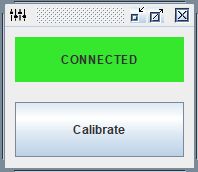
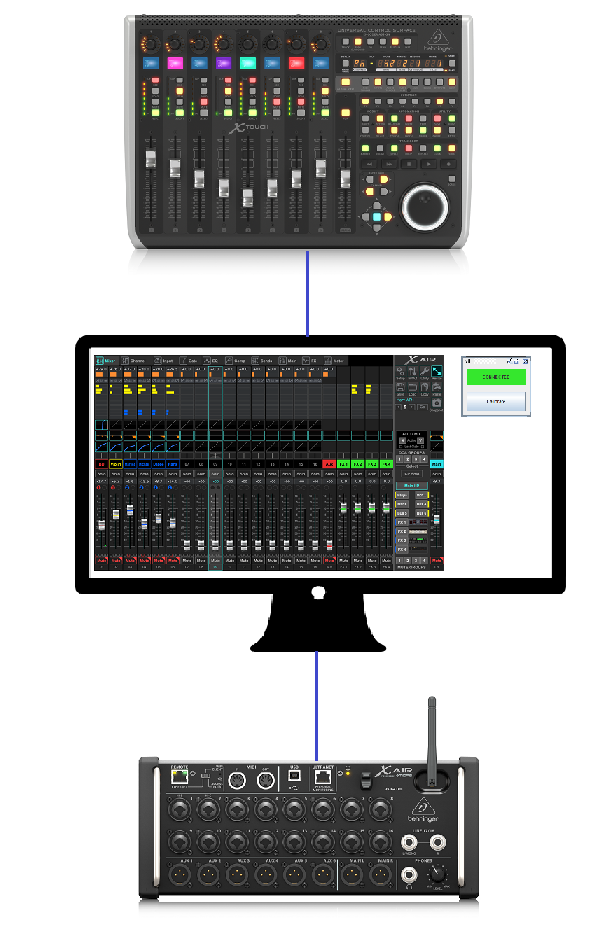
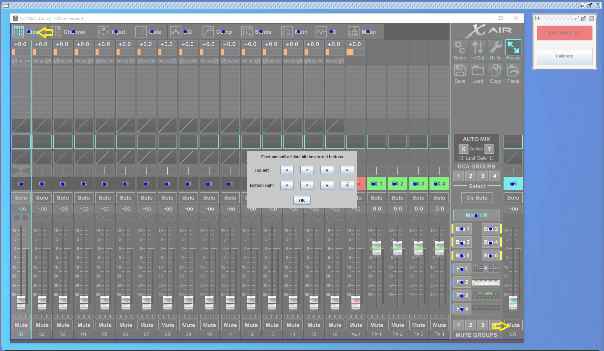
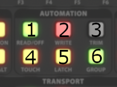
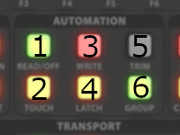

# XTouch

A JVM (Kotlin) proxy-tool that sits between a Behringer X-Touch controller and a Behringer X-Air XR18 digital mixer.
It monitors what buttons are pressed on the X-Touch, and it controls the X-Air-Edit app.

## Purpose

When using an X-Touch in combination with the X-Air-Edit dektop app,
there is no link between the X-Touch and the X-Air-Edit app.
E.g.: When you adjust the EQ of a channel with the X-Touch,
you have to manually select that channel and the EQ tab in X-Air-Edit.

This proxy-tool looks at all the buttons that are pressed on the X-Touch,
and clicks the matching button in the X-Air-Edit app so that the relevant parts are visible.
The X-Air-Edit app now "follows" the X-Touch.

## Usage

1. Build a jar of this tool with maven: `mvn package`
1. Make sure the *java* process is allowed to control the mouse.
    * On Mac, this is located under `System Preferences` > `Security & Privacy` > `Accessibility`
1. Configure this proxy-tool to connect to the XR18 mixer by setting its IP address.
In your home-directory, create a directory **xtouch** with a file **xtouch.properties**.  
File: **~/xtouch/xtouch.properties**  
Contents: `xr18.ipaddress=192.168.0.2`
1. Start X-Air-Edit
1. Start this proxy-tool: `java -jar XTouch-2.0-SNAPSHOT-jar-with-dependencies.jar`
1. Calibrate the proxy-tool so that it knows where to click in the X-Air-Edit app.   
    
By clicking on two positions in the app, a first guess is done.
You still have the possibility to fine-tune the calibration.
    * Click the *Calibrate* button
    * Click Mixer-button in the top-left of the X-Air-Edit app.
    * Click the Mute button of the main LR channel in the bottom-right of the app.
    * Calibrate the top-left and the bottom-right corner of the app until all dots appear over the correct buttons in the X-Air-Edit app.
    This is where the proxy-tool will click for selecting the correct channel etc.
1. Turn on the X-Touch controller while holding the Select-button of the first channel.
1. Configure the X-Touch to use Xctl: `Xctl`, `Xctl/MC`, or `XctlHUI`
1. Enter the IP address of the host that is running this proxy-tool.
1. Confirm the settings.
The X-Touch should now connect to this proxy-tool.
This will be indicated by a green message *Connected*.

## Addons

Some extra functions are provided.
They are enabled by default.
They can be disabled by setting their configuration option to false in **~/xtouch/xtouch.properties**.

* `router.mutebuttons`
    * The buttons next to *Global view* will function as mute buttons for the output channels (buses and main output).
    * 
* `router.busorder`
    * The order of the bus buttons operate according to N-order instead of Z-order.
    More like the buttons in the X-Air-Edit app.
    * Before: Z-order    
    
    * After: N-order    
    
* `router.busscribblestrip`
    * When selecting an effects send or bus send, the channel names are still displayed.
    * When pressing down the channel knob, the **tap** is displayed like normal (`IN`, `PREEQ`, `POSTEQ`, `PRE`, `POST`, `GRP`)
* `router.linkbusleds`
    * Both bus leds light up when a linked bus is selected.
* `router.channelcue`
    * Pressing `FLIP` when a bus is selected, sets that bus as monitor channel.
    * Pressing `REC` when in the `SENDS` encoder is selected, sets that bus as monitor channel.
* `router.sinedemo`
    * Pressing `DISPLAY` will show a demo the faders moving as a sine.
* `xairedit.interact`
    * Clicks in the X-Air-Edit app to keep it in sync with the XTouch Controller.
    Disable if you just want to use the addons.
* `xairedit.conect`
    * Disabled by default.
    Will click the "Connect" and "Mixer -> PC" buttons during startup, to connect the X-Air-Edit app with the XR18.
* `ui`
    * Disable to run this app on headless systems.